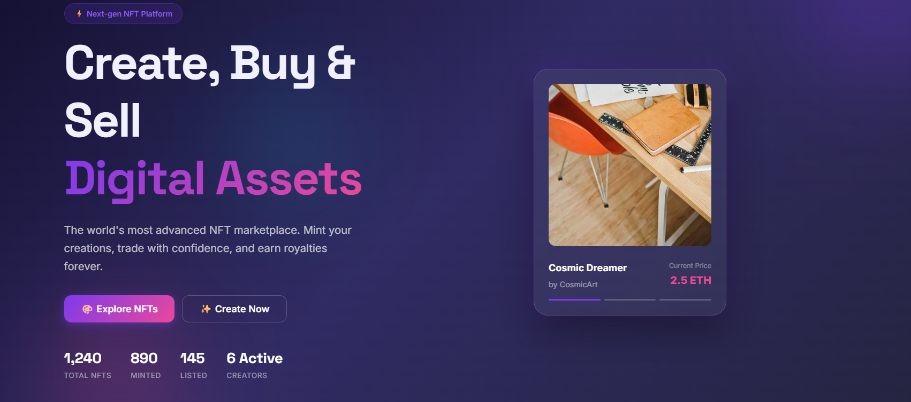

# 🎨 EpicMint — Full-Stack Web3 NFT Marketplace & Blogging Platform

<p align="center">
  
</p>

> EpicMint V2 is a state-of-the-art, production-grade Web3 application combining an Ethereum ERC-721 NFT marketplace with a full-stack MongoDB-powered blogging platform, Gemini AI generation suite, Pinata IPFS media pinning, Google OAuth, and MetaMask wallet integration.

---

## 📋 Table of Contents

- [Overview & Architecture](#-overview--architecture)
- [Key Features](#-key-features)
- [Tech Stack](#-tech-stack)
- [Project Structure](#-project-structure)
- [Environment Configuration](#-environment-configuration)
- [Getting Started](#-getting-started)
- [Full Stack Deployment (Vercel & Render)](#-full-stack-deployment-vercel--render)
- [API Reference](#-api-reference)
- [Smart Contract](#-smart-contract)

---

## 🌟 Overview & Architecture

EpicMint operates as a decoupled, multi-tier Web3 platform:

| Layer | Technology | Purpose |
|---|---|---|
| **Frontend** | React 18 + Vite + React Router DOM v6 | Single Page App (SPA) for marketplace, profile, and blogging |
| **Backend API** | Node.js + Express + MongoDB Atlas | RESTful API, JWT & Google Auth, file uploads, AI generation |
| **Blogging Engine** | MongoDB Mongoose + Gemini AI | Full CRUD blogging system with AI content generation & IPFS cover uploads |
| **Storage** | Pinata IPFS + Sharp Engine | Decentralized asset storage with automated image compression |
| **Blockchain** | Solidity + Hardhat + ethers.js v6 | ERC-721 smart contract deployed on Sepolia Testnet |

---

## ✨ Key Features

### 📰 Full-Stack Blog Platform (MongoDB + Gemini AI)
- **MongoDB Powered**: Complete CRUD blog management backed by Mongoose schemas.
- **✨ Gemini AI Writer**: Auto-generates structured blog posts (Title, Excerpt, Content, Tags, Read Time, Meta Description) using `gemini-3.1-flash-lite`.
- **🖼️ Pinata IPFS Cover Uploads**: Direct image upload with server-side Sharp image compression for sub-1MB optimization.
- **🛡️ Granular Authorization**: Server-enforced ownership middleware (`blogOwner`) ensuring only original authors or admins can edit/delete articles.
- **🔍 Filter & Search**: Real-time debounced keyword search, category filtering, Latest/Popular sorting, and paginated grid layout.
- **👁️ Views & ❤️ Likes**: Atomic view increments and toggleable user likes.

### 🎨 NFT Marketplace & Blockchain Integration
- **ERC-721 Smart Contract**: OpenZeppelin standard deployed on Ethereum Sepolia testnet.
- **MetaMask Integration**: Web3 wallet connection, balance fetching, message signing, and transaction tracking.
- **🤖 AI-Assisted Minting**: Title, description, tag, and attribute generation via Google Gemini.
- **📱 Multi-Provider QR Code Sharing**: Shares NFTs via QuickChart, QRServer, and Google Charts fallback engines.

### 🔐 Authentication & Security
- **Dual Authentication**: Google OAuth 2.0 (`google-auth-library`) & standard Email/Password authentication with JWT.
- **Protected Routes**: React Router `ProtectedRoute` guards for `/profile`, `/create`, and `/create-blog`.
- **Security Hardening**: Helmet security headers, CORS origin whitelisting, auth rate-limiting, and error-handling middleware.

---

## 🛠 Tech Stack

### Frontend
- **Framework**: React 18.3, Vite 5.4
- **Routing**: React Router DOM 6.28
- **Blockchain**: ethers.js 6.15
- **HTTP Client**: Axios 1.7

### Backend
- **Framework**: Express 4.19, Node.js v24
- **Database**: MongoDB Atlas via Mongoose 8.13
- **Security**: jsonwebtoken 9.0, helmet, cors, express-rate-limit
- **AI Integration**: `@google/generative-ai` (`gemini-3.1-flash-lite`)
- **Media & IPFS**: Multer, Sharp, Pinata SDK

---

## 📁 Project Structure

```
epicmint-main/
├── api/                        # Vercel Serverless API entrypoint
│   └── index.js
├── backend/                    # Express REST API
│   ├── src/
│   │   ├── config/             # DB connection (MongoDB Atlas)
│   │   ├── controllers/        # Auth, Blog, BlogAI, NFT, Comment controllers
│   │   ├── middleware/         # Auth, BlogOwner, RateLimiter, ErrorHandler
│   │   ├── models/             # User, Blog, NFT, Comment schemas
│   │   ├── routes/             # API routes (/api/blogs, /api/auth, etc.)
│   │   ├── services/           # Pinata IPFS service
│   │   └── server.js           # Main Express server
│   ├── .env                    # Backend environment variables
│   └── package.json
├── frontend/                   # React 18 + Vite SPA
│   ├── src/
│   │   ├── components/         # Reusable UI components & Modals
│   │   │   ├── AIBlogModal.jsx
│   │   │   ├── BlogOwnerActions.jsx
│   │   │   ├── BlogSkeleton.jsx
│   │   │   ├── ConfirmDeleteModal.jsx
│   │   │   ├── ProtectedRoute.jsx
│   │   │   ├── QRCode.jsx
│   │   │   └── Toast.jsx
│   │   ├── contexts/           # AuthContext & Web3Context
│   │   ├── lib/                # API client & Web3 helpers
│   │   ├── pages/              # Route pages (Home, Marketplace, Blog, Create, Profile)
│   │   └── App.jsx             # React Router configuration
│   ├── vercel.json             # SPA rewrites config
│   ├── vite.config.js          # Vite server & proxy configuration
│   └── .env                    # Frontend environment variables
├── package.json                # Root package.json for monorepo builds
└── vercel.json                 # Root Vercel deployment configuration
```

---

## ⚙️ Environment Configuration

### Backend Environment Variables (`backend/.env`)

```env
PORT=5000
NODE_ENV=development
FRONTEND_URL=http://localhost:3000,http://localhost:3001
MONGODB_URI=mongodb+srv://<user>:<password>@cluster.mongodb.net/epicmint
JWT_SECRET=your_jwt_secret_key
JWT_EXPIRES_IN=7d
PINATA_API_KEY=your_pinata_api_key
PINATA_API_SECRET=your_pinata_api_secret
PINATA_JWT=your_pinata_jwt
GOOGLE_CLIENT_ID=your_google_oauth_client_id.apps.googleusercontent.com
GOOGLE_CLIENT_SECRET=your_google_oauth_client_secret
GEMINI_API_KEY=your_gemini_ai_api_key
```

### Frontend Environment Variables (`frontend/.env`)

```env
VITE_API_URL=http://localhost:5000
VITE_CHAIN_ID=11155111
VITE_CONTRACT_ADDRESS=0xd8b934580fcE35a11B58C6D73aDeE468a2833fa8
VITE_GOOGLE_CLIENT_ID=your_google_oauth_client_id.apps.googleusercontent.com
```

---

## 🚀 Getting Started

### 1. Clone & Install Dependencies

```bash
# Clone the repository
git clone https://github.com/sonisuryansh/EpicMint-V2.git
cd EpicMint-V2

# Install backend dependencies
cd backend
npm install

# Install frontend dependencies
cd ../frontend
npm install
```

### 2. Start Local Development

**Start Backend API**:
```bash
cd backend
npm start
# Express running on http://localhost:5000
```

**Start Frontend Application**:
```bash
cd frontend
npm run dev
# Vite running on http://localhost:3000
```

---

## 🌐 Full Stack Deployment (Vercel & Render)

### Deployed to Vercel (Frontend & Serverless Functions)
1. Import `sonisuryansh/EpicMint-V2` repository into Vercel.
2. Vercel automatically uses the root `package.json` build command (`cd frontend && npm install && npm run build`).
3. Root `vercel.json` applies SPA rewrites for non-API routes (`/((?!api/).*)` -> `/index.html`) to prevent `404 NOT_FOUND` on page refreshes (`F5`) or direct URL entrances.

### Deployed to Render.com (Express Backend API)
1. Create a Web Service on Render pointing to `backend/`.
2. Build Command: `npm install`
3. Start Command: `npm start`
4. Set Environment Variables in Render Dashboard (`MONGODB_URI`, `JWT_SECRET`, `PINATA_JWT`, `GEMINI_API_KEY`, etc.).

---

## 📑 API Reference

### Blog Endpoints (`/api/blogs`)
- `GET /api/blogs` — Public paginated blog list (query params: `page`, `limit`, `category`, `search`, `sort`, `author`)
- `GET /api/blogs/:slug` — Public blog detail by slug
- `POST /api/blogs` — Protected. Create new blog draft/published
- `PUT /api/blogs/:id` — Protected + BlogOwner. Update blog
- `DELETE /api/blogs/:id` — Protected + BlogOwner. Delete blog
- `PATCH /api/blogs/:id/view` — Increment view count
- `PATCH /api/blogs/:id/like` — Toggle article like

### Blog AI Endpoint (`/api/blog-ai`)
- `POST /api/blog-ai/generate` — Protected. Generate complete Web3 blog draft via Gemini AI (`topic`, `keywords`, `tone`, `audience`, `length`)

### Upload Endpoints (`/api/uploads`)
- `POST /api/uploads/image` — Upload image file to Pinata IPFS (with auto Sharp compression)
- `POST /api/uploads/metadata` — Upload ERC-721 JSON metadata to Pinata IPFS

---

## 📜 Smart Contract

- **Contract Address**: `0xd8b934580fcE35a11B58C6D73aDeE468a2833fa8`
- **Network**: Ethereum Sepolia Testnet (Chain ID `11155111`)
- **Standard**: ERC-721 URI Storage (OpenZeppelin)
- **Explorer**: [View on Sepolia Etherscan](https://sepolia.etherscan.io/address/0xd8b934580fcE35a11B58C6D73aDeE468a2833fa8)

---

<p align="center">
  Built with ❤️ for Web3 Creators and Developers.
</p>
